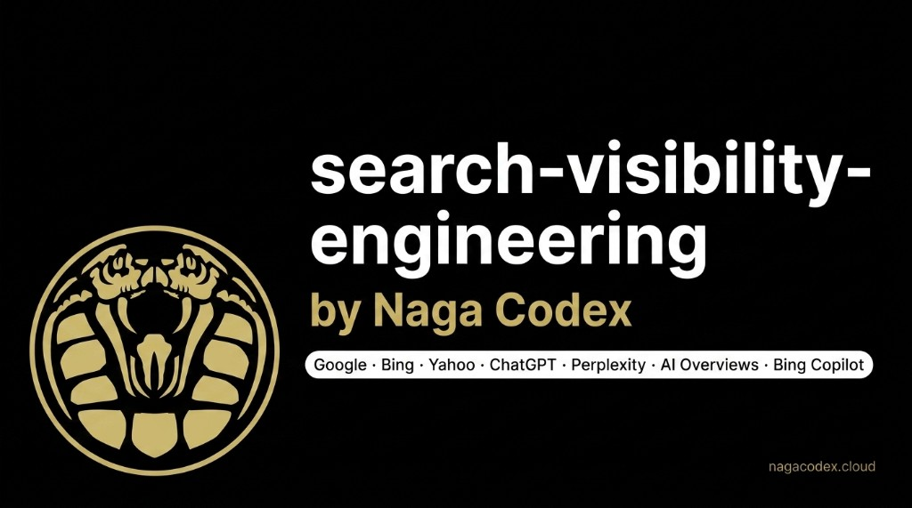
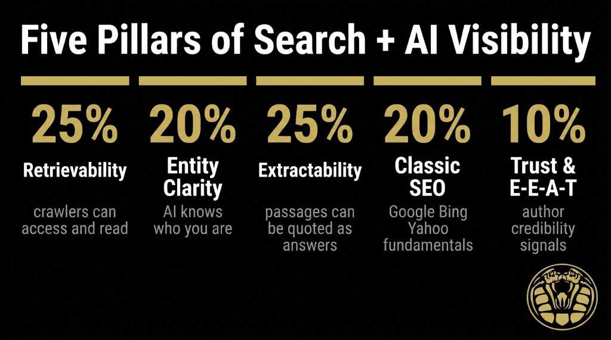
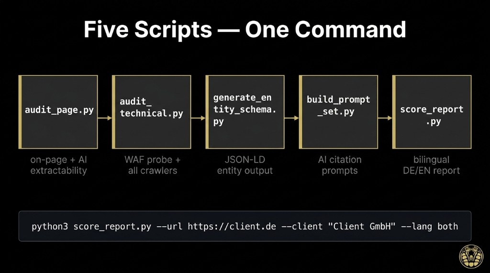

# search-visibility-engineering



**Practical SEO + AI Search Visibility — Google, Bing, Yahoo, ChatGPT, Perplexity, AI Overviews**

Five Python scripts that audit, generate, score, and measure. No vendor lock-in. No magic files. Evidence-graded levers with primary source citations built into the code.


---

## What this covers

| Platform | Tool |
|----------|------|
| Google Search (organic) | `audit_page.py` + `audit_technical.py` |
| Bing / Yahoo (Bing-powered) | `audit_technical.py` (Bingbot rules, IndexNow) |
| Google AI Overviews | `audit_page.py` (extractability) + `audit_technical.py` (Googlebot access — same index) |
| ChatGPT (OAI-SearchBot) | `audit_technical.py` (WAF probe) |
| Perplexity | `audit_technical.py` (WAF probe, PerplexityBot) |
| Bing Copilot | `audit_technical.py` (Bingbot) |
| All engines (measurement) | `build_prompt_set.py` → manual probe |

---

## Scripts

### `audit_page.py` — On-page + AI extractability audit
Fetches the page **without JavaScript** (exactly as AI crawlers see it).

Checks: title, meta description, canonical, OG, viewport · H1/H2/H3 hierarchy · JSON-LD presence and parse validity · word count and content extractability score · self-contained paragraphs, statistics density, FAQ, tables · E-E-A-T signals (author, date, Impressum, citations) · image alt coverage · JS-only shell detection.

```bash
python3 audit_page.py https://nagacodex.cloud
python3 audit_page.py https://nagacodex.cloud --output json --save page.json
```

### `audit_technical.py` — Technical + crawler access audit
The most underdiagnosed issue: **WAF/Cloudflare blocking AI crawlers** while the browser gets 200. Site ranks in Google, never cited in ChatGPT. This catches it.

Checks: robots.txt rules per crawler (Googlebot, Bingbot, GPTBot, OAI-SearchBot, ClaudeBot, anthropic-ai, PerplexityBot, Google-Extended, Applebot-Extended, Meta-ExternalAgent) · live WAF probe with each user-agent · sitemap presence and validity · HTTP→HTTPS redirect · redirect chain depth · HSTS · compression · X-Robots-Tag header · IndexNow · llms.txt (low-priority note included) · Core Web Vitals via PageSpeed Insights API (optional).

```bash
python3 audit_technical.py nagacodex.cloud
python3 audit_technical.py nagacodex.cloud --psi-key YOUR_KEY  # adds Core Web Vitals
python3 audit_technical.py nagacodex.cloud --output json --save tech.json
```

**Key fact on Google-Extended:** Blocking `Google-Extended` in robots.txt prevents Gemini from using your content for *model training*. It does **not** prevent your pages from appearing in AI Overviews. AI Overviews use the regular Googlebot index. This is one of the most common client misconceptions.

### `generate_entity_schema.py` — JSON-LD entity schema generator
Generates validated JSON-LD structured data: Organization/LocalBusiness, WebSite (with SearchAction), WebPage, FAQPage, BreadcrumbList, Service, Person. Ready to paste into `<head>`.

```bash
# Interactive guided mode
python3 generate_entity_schema.py --interactive

# From config file
python3 generate_entity_schema.py --config examples/nagacodex_config.yaml

# One-liner
python3 generate_entity_schema.py \
  --name "Mustermann GmbH" --type LocalBusiness \
  --url https://mustermann.de \
  --description "..." --city Hamburg
```

Validate output at:
- https://validator.schema.org/
- https://search.google.com/test/rich-results

### `build_prompt_set.py` — AI probe prompt generator
Generates 20–40 buyer-intent prompts (DE + EN) across six categories: discovery, problem-aware, comparison, brand, service, trust. Run them in ChatGPT, Perplexity, Google AI Mode, and Bing Copilot to measure citation rate and share of voice.

```bash
python3 build_prompt_set.py \
  --business "Naga Codex" \
  --category "digital performance consultancy" \
  --services "SEO Audit" "Landing Page Design" \
  --location "Hamburg" \
  --competitors "Hype Group" "Leap"

# Or from config:
python3 build_prompt_set.py --config examples/nagacodex_config.yaml --save prompts.txt
```

**Measurement procedure:** run each prompt in a fresh conversation, record yes/no citation + sentiment + competitor mentions. Citation rate = (cited / total) × 100. Baseline before changes, repeat after 6–8 weeks.

### `score_report.py` — Aggregated scoring + bilingual report
Reads JSON outputs from both audit scripts, computes weighted pillar scores, ranks all fixes by impact/effort, and generates a professional bilingual (DE/EN) HTML report ready to send to clients.

```bash
# Full run (runs both audits automatically):
python3 score_report.py --url https://nagacodex.cloud --client "Naga Codex"

# From pre-run audit files:
python3 score_report.py \
  --page page.json --tech tech.json \
  --client "Mustermann GmbH" \
  --lang both \
  --save mustermann_report
```

---

## How it works





## Five pillars (weighted score)

| Pillar | Weight | What it covers |
|--------|--------|----------------|
| Retrievability | 25% | Can all crawlers fetch and read the content? |
| Entity Clarity | 20% | Does the machine know who you are? (JSON-LD, sameAs, off-site presence) |
| Content Extractability | 25% | Can AI systems quote your content as standalone answers? |
| Classic SEO | 20% | Google/Bing fundamentals: title, meta, H1, sitemap, CWV |
| Trust & E-E-A-T | 10% | Author, date, Impressum, citations, credentials |

---

## Install

```bash
pip3 install -r requirements.txt
```

Requires Python 3.10+. No API keys needed for most checks. PageSpeed Insights (Core Web Vitals) works without a key at low rate limits; pass `--psi-key` for higher quota.

---

## Evidence grading

Every lever in the code is tagged with its evidence base:

- **CONFIRMED** — primary source: Google Search Central, Bing Webmaster Guidelines, official crawler docs, schema.org
- **MEASURED** — independent study: Ahrefs (137K domains), Princeton GEO paper, third-party crawl analysis
- **CLAIMED** — vendor correlation studies only (treated as directionally useful, not definitive)

**On llms.txt:** Ahrefs studied 137K domains (June 2026): 97% of llms.txt files received zero AI crawler traffic. Google's generative-AI guidance has a mythbusting section stating it's not a ranking or AI Overviews factor. We include a check but mark it low-priority. If a site has developer docs: add it in 10 minutes. For pure marketing sites: skip it.

---

## Quick start for a client engagement

```bash
# 1. Install
pip3 install -r requirements.txt

# 2. Full audit + report (one command)
python3 score_report.py \
  --url https://client-domain.de \
  --client "Client Name GmbH" \
  --lang both \
  --save client_report

# → client_report_de.html + client_report_en.html (ready to attach)

# 3. Generate entity schema
python3 generate_entity_schema.py --interactive > schema.html

# 4. Generate AI probe prompt set
python3 build_prompt_set.py \
  --business "Client Name" --category "their category" \
  --location "their city" --lang de \
  --save prompts.txt

# 5. Run prompts manually in ChatGPT, Perplexity, Google AI Mode, Bing Copilot
# Record citations in the table at the bottom of prompts.txt
```

---

## Part of the Naga Codex search-visibility-engineering skill

Built by [Naga Codex](https://nagacodex.cloud) · Maurice Holda  
[linkedin.com/in/maurice-holda](https://linkedin.com/in/maurice-holda)
